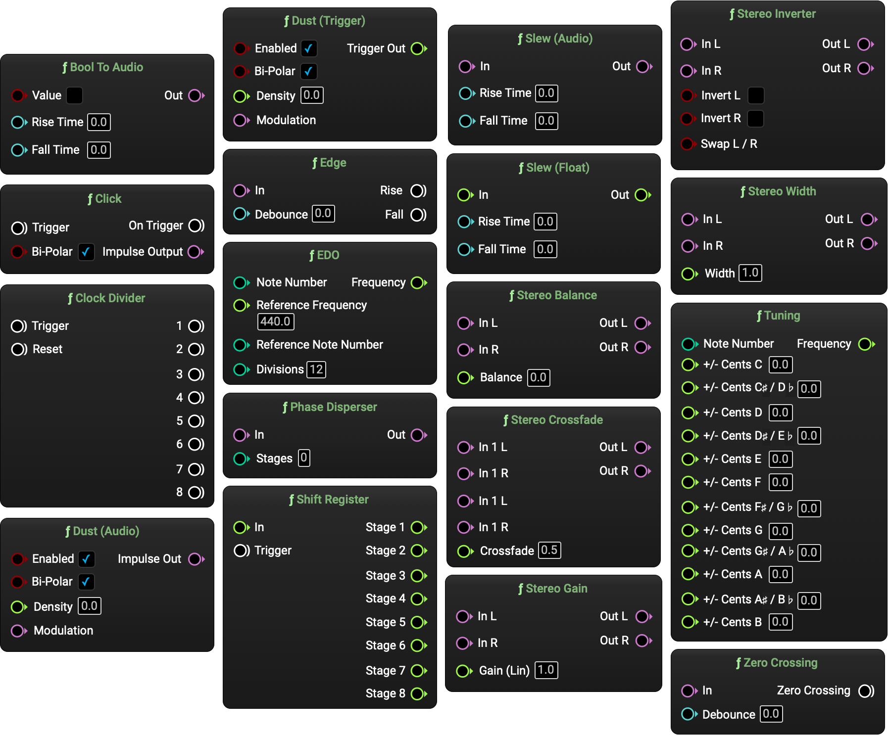

# MetaSound-Plugins 
This repository contains a collection of custom nodes for Unreal Engine's MetaSounds, which I am working toward releasing as a plugin (working title: "Branches").

## Branches
There are currently fourteen nodes available in the *MetaSoundBranches* plugin for testing, with several more in development:

| Node                                | Category              | Description                                                                                                         |
|-------------------------------------|-----------------------|---------------------------------------------------------------------------------------------------------------------|
| `Bool To Audio`                     | Conversions           | Convert a boolean value to an audio signal, with optional rise and fall times.                                      |
| `Clock Divider`                     | Triggers              | Divide a trigger into eight density levels.                                                                         |
| `Click`                             | Generators            | Trigger a one-sample impulse (unipolar or alternating polarity per impulse).                                        |
| `Dust`                              | Generators            | A randomly timed impulse generator (unipolar or alternating polarity per impulse) with density control and audio-rate modulation. |
| `EDO`                               | Tuning                | Generate frequencies for tuning systems using equally divided octaves (float) with a MIDI note input. Set a reference frequency and reference MIDI note (defaults to A440). |
| `Phase Disperser`                   | Filters               | A chain of allpass filters to soften transients and add that classic laser/slinky-style effect.                      |
| `Sample And Hold (audio trigger)`   | Filters               | An alternative sample and hold unit with an audio-rate trigger.                                                     |
| `Shift Register`                    | Modulation            | An eight-stage shift register for floats.                                                                           |
| `Slew (audio)`                      | Filters               | A slew limiter to smooth out the rise and fall times of an audio signal.                                             |
| `Slew (float)`                      | Filters               | A slew limiter to smooth out the rise and fall times of an audio signal.                                             |
| `Stereo Crossfade`                  | Envelopes             | A crossfader for stereo signals.                                                                                    |
| `Stereo Inverter`                   | Spatialization        | Invert and/or swap stereo channels.                                                                                 |
| `Stereo Width`                             | Spatialization        | Stereo width adjustment (0-200%), using mid-side processing.                                                        |
| `Tuning`                            | Tuning                | Quantize a float value to a custom 12-note tuning, with adjustment in cents per-note.                               |

Upon installing the plugin, these items will appear in the sub-category `Branches` within the Metasound `Functions` category.




## Installation
- Clone the repository into your chosen Unreal Engine project's `Plugins` directory.
- Build the project using the [Unreal Automation Tool](https://dev.epicgames.com/documentation/en-us/unreal-engine/unreal-automation-tool-for-unreal-engine):

### Windows
- In PowerShell, navigate to the `Engine\Build\BatchFiles\` folder, and run: 
```PowerShell
.\RunUAT.bat BuildPlugin -plugin="<path to your project>\Plugins\metasound-plugins\MetasoundBranches.uplugin" -package="<path to your project>\Plugins\metasound-plugins\MetasoundBranches.uplugin"
```
### Mac
- In terminal, navigate to the `Engine/Build/BatchFiles/` folder, and run: 
```Bash
sudo ./RunUAT.sh BuildPlugin -plugin="<path to your project>/Plugins/metasound-plugins/MetasoundBranches.uplugin" -package="<path to your project>/Plugins/metasound-plugins/MetasoundBranches.uplugin"
```

Please see [Learning / Building Plugins](https://dev.epicgames.com/community/learning/tutorials/qz93/unreal-engine-building-plugins) for more information.

## Documentation
Development notes:
- [Initial notes](./docs/README.md): information on the first custom node and development process.
- [Quick reference](./docs/quick_reference.md): some development notes for creating and troubleshooting custom nodes. 

---

## Links
- [MetaSounds Reference Guide](https://dev.epicgames.com/documentation/en-us/unreal-engine/metasounds-reference-guide-in-unreal-engine)
- [MetaSounds Tutorial videos](https://dev.epicgames.com/community/learning/recommended-community-tutorial/Kw7l/unreal-engine-metasounds) (Matt Spendlove)
- [Creating MetaSound Nodes in C++ Quickstart](https://dev.epicgames.com/community/learning/tutorials/ry7p/unreal-engine-creating-metasound-nodes-in-c-quickstart) (Anna Lantz)