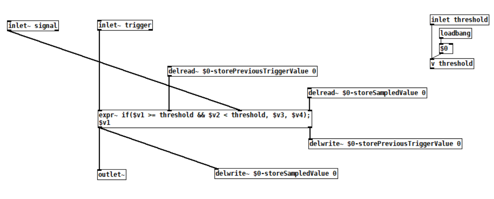

# Documentation

As a starting point for the documentation, I'm throwing together some of my notes on the custom nodes and the thought processes behind them.

## Audio Rate Sample and Hold

### Function
The output signal is held at the last value of the input signal when the trigger signal crosses a threshold.

The sample and hold function in Metasynth takes an audio rate signal as input, and a trigger signal as float.

A purely audio-rate version seemed like a good starting point for my first custom node in Metasynth, since it's one of my go-to building blocks in other environments such as Pd.
The threshold control remains a float, as it's rare that we'd be setting this all that frequently.

### Inputs
- **Signal**: Audio rate signal to be sampled.
- **Trigger**: Audio rate signal that triggers the sample and hold.
- **Threshold**: Float value that determines when the trigger signal is considered "on".

### Outputs
- **Output**: The sampled signal.

### C++ Implementation

I used Anna Lantz's tutorial [Creating MetaSound Nodes in C++ Quickstart](https://dev.epicgames.com/community/learning/tutorials/ry7p/unreal-engine-creating-metasound-nodes-in-c-quickstart) as a starting point.

Most of the .cpp file is occupied by setting up the node and its pins (inlets/outlets), and registering the node. 
The implementation of the sample and hold itself is quite straightforward.

#### Constructor ("setup"):
```cpp
 FSahOperator(
            const FAudioBufferReadRef& InSignal,
            const FAudioBufferReadRef& InTrigger,
            const FFloatReadRef& InThreshold)
            : InputSignal(InSignal)
            , InputTrigger(InTrigger)
            , InputThreshold(InThreshold)
            , OutputSignal(FAudioBufferWriteRef::CreateNew(InSignal->Num()))
            , SampledValue(0.0f)
            , PreviousTriggerValue(0.0f)
        {
        }
```

#### Execute ("loop"):
```cpp
void Execute()
        {
            int32 NumFrames = InputSignal->Num();

            const float* SignalData = InputSignal->GetData();
            const float* TriggerData = InputTrigger->GetData();
            float* OutputData = OutputSignal->GetData();

            float Threshold = *InputThreshold;

            for (int32 i = 0; i < NumFrames; ++i)
            {
                float CurrentTriggerValue = TriggerData[i];

                // Detect rising edge
                if (PreviousTriggerValue < Threshold && CurrentTriggerValue >= Threshold)
                {
                    // Sample the input signal
                    SampledValue = SignalData[i];
                }

                // Output the sampled value
                OutputData[i] = SampledValue;

                // Update previous trigger value
                PreviousTriggerValue = CurrentTriggerValue;
            }
        }
```

### Pure Data Implementation
Pure Data already has a sample and hold object [samphold~], which accepts audio rate signals through both inlets.
I thought this might help illustrate the process for people less familiar with DSP code. 
However, since the idea is to stay in audio rate, we don't exactly end up with a typical Pd patch.


- [Pure Data abstraction](./SaH_audiorate.pd)
- [Example patch](./SaH_audiorate_example.pd)

Unlike other environments like Max, there's no built-in object for `[>~]` (a "greater than" comparison) in Pd. 
Instead, we can use the `[expr~]` object, which evaluates a C-like expression.
Inputs are defined within the expression as `$v1`, `$v2`, etc.
Multiple outputs can be defined by adding another expression after a semicolon (in this case, simply duplicating the input trigger value).

We can use a variable (represented by `[value]` or `[v]`) for `InputThreshold`. 
`InputTrigger` is represented by `$v1`, and `InputSignal` is `$v2`.
Other key variables would be `SampledValue` and `previousTriggerValue`. 
As far as I know, `[expr~]` does not allow setting variables directly within the expression, and we can't create a feedback loop even if the values don't go through the same path[^1].  
Instead, we need to send the information out through the patch, which we do through delay lines with time set to 0 (`[delwrite~]` and `[delread~]`).
The expr~ object is used to detect when the trigger signal crosses the threshold, and then the value of the input signal is sampled and held until the next trigger event.

[^1]: We can skip the delays using `[fexpr~]` instead: `if($x1[-1] < threshold && $x1[0], $x2, f1)`, but the above example highlights similar feedback issues that we might encounter in pure Metasound vs. coding in C++.
