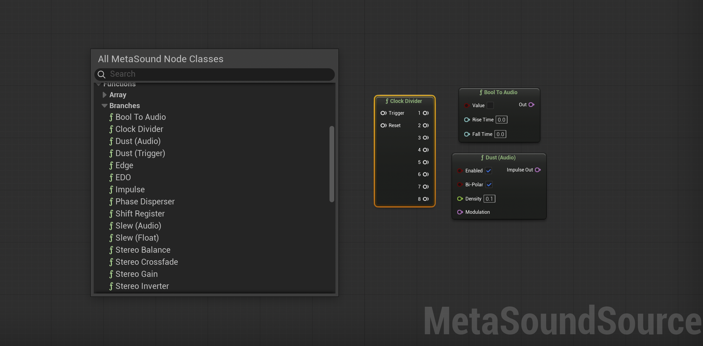

A collection of custom nodes for Unreal Engine's MetaSounds, available as the *Branches* plugin for Windows and Mac.

To download the latest version for testing, please visit [https://github.com/matthewscharles/metasound-branches/](https://github.com/matthewscharles/metasound-branches/).

# Branches Plugin

## Getting started

> [Video: getting started](https://www.youtube.com/playlist?list=PLyaaHTyXd8jFk4KFjPJTPzIwHcse9_xeC)

This plugin works within the existing MetaSound system. For an introduction, please see the official [MetaSounds Reference Guide](https://dev.epicgames.com/documentation/en-us/unreal-engine/metasounds-reference-guide-in-unreal-engine).

Once installed, create a new MetaSound Source and right-click in the editor to add a new node class.  A new `Branches` category will appear under `Functions`.

## Examples

Examples showing the nodes in musical contexts are available on YouTube and through a sample project on the forthcoming Fab listing:
> [Video: example patches](https://www.youtube.com/watch?v=HgudP5fzDWM)

To explore the sample project, load the MetaSound Sources in the `Content/Audio/MetaSound-Examples` folder and press play to listen.  

Note: the example MSS files are intended to demonstrate how the nodes can be connected, rather than for direct use in Unreal Engine projects.

## Nodes
The custom nodes consist of utilities to handle triggers, sequencing and tuning, as well as a selection of tools for simple stereo processing.

There are currently eighteen nodes available in the *MetaSound Branches* plugin, with several more in development.  

Click on each node name below for a summary including inputs and outputs.

| Node | Category | Description |
|------|-----------|-------------|
| [`Bool To Audio`](https://matthewscharles.github.io/metasound-branches/BoolToAudio.html) | Conversions | Convert a boolean value to an audio signal, with optional rise and fall times. |
| [`Clock Divider`](https://matthewscharles.github.io/metasound-branches/ClockDivider.html) | Triggers | Divide a trigger into eight density levels. |
| [`Dust (Audio)`](https://matthewscharles.github.io/metasound-branches/Dust(Audio).html) | Generators | Generate randomly timed impulses (unipolar or alternating polarity per impulse) with density control and audio-rate modulation. |
| [`Dust (Trigger)`](https://matthewscharles.github.io/metasound-branches/Dust(Trigger).html) | Generators | Generate randomly timed impulses (unipolar or alternating polarity per impulse) with density control and audio-rate modulation. |
| [`Edge`](https://matthewscharles.github.io/metasound-branches/Edge.html) | Envelopes | Detect upward and downward changes in an input audio signal, with optional debounce. |
| [`EDO`](https://matthewscharles.github.io/metasound-branches/EDO.html) | Tuning | Generate frequencies for tuning systems using equally divided octaves with a MIDI note input. Set a reference frequency and reference MIDI note (defaults to A440). |
| [`Impulse`](https://matthewscharles.github.io/metasound-branches/Impulse.html) | Generators | Trigger a one-sample impulse (unipolar or alternating polarity per impulse). |
| [`Phase Disperser`](https://matthewscharles.github.io/metasound-branches/PhaseDisperser.html) | Filters | A chain of allpass filters acting as a phase disperser to soften transients. |
| [`Shift Register`](https://matthewscharles.github.io/metasound-branches/ShiftRegister.html) | Modulation | An eight-stage shift register for floats. |
| [`Slew (Audio)`](https://matthewscharles.github.io/metasound-branches/Slew(Audio).html) | Filters | A slew rate limiter to smooth out the rise and fall times of an audio signal. |
| [`Slew (Float)`](https://matthewscharles.github.io/metasound-branches/Slew(Float).html) | Filters | A slew limiter to smooth out the rise and fall times of a float value. |
| [`Stereo Balance`](https://matthewscharles.github.io/metasound-branches/StereoBalance.html) | Spatialization | Adjust the balance of a stereo signal. |
| [`Stereo Crossfade`](https://matthewscharles.github.io/metasound-branches/StereoCrossfade.html) | Envelopes | Crossfade between two stereo signals. |
| [`Stereo Gain`](https://matthewscharles.github.io/metasound-branches/StereoGain.html) | Mix | Adjust gain for a stereo signal. |
| [`Stereo Inverter`](https://matthewscharles.github.io/metasound-branches/StereoInverter.html) | Spatialization | Invert and/or swap stereo channels. |
| [`Stereo Width`](https://matthewscharles.github.io/metasound-branches/StereoWidth.html) | Spatialization | Stereo width adjustment (0-200%), using mid-side processing. |
| [`Tuning`](https://matthewscharles.github.io/metasound-branches/Tuning.html) | Tuning | Quantize a float value to a custom 12-note tuning, with adjustment in cents per-note. |
| [`Zero Crossing`](https://matthewscharles.github.io/metasound-branches/ZeroCrossing.html) | Envelopes | Detect zero crossings in an input audio signal, with optional debounce. |

---

[Charles Matthews 2025](https://github.com/matthewscharles/)
