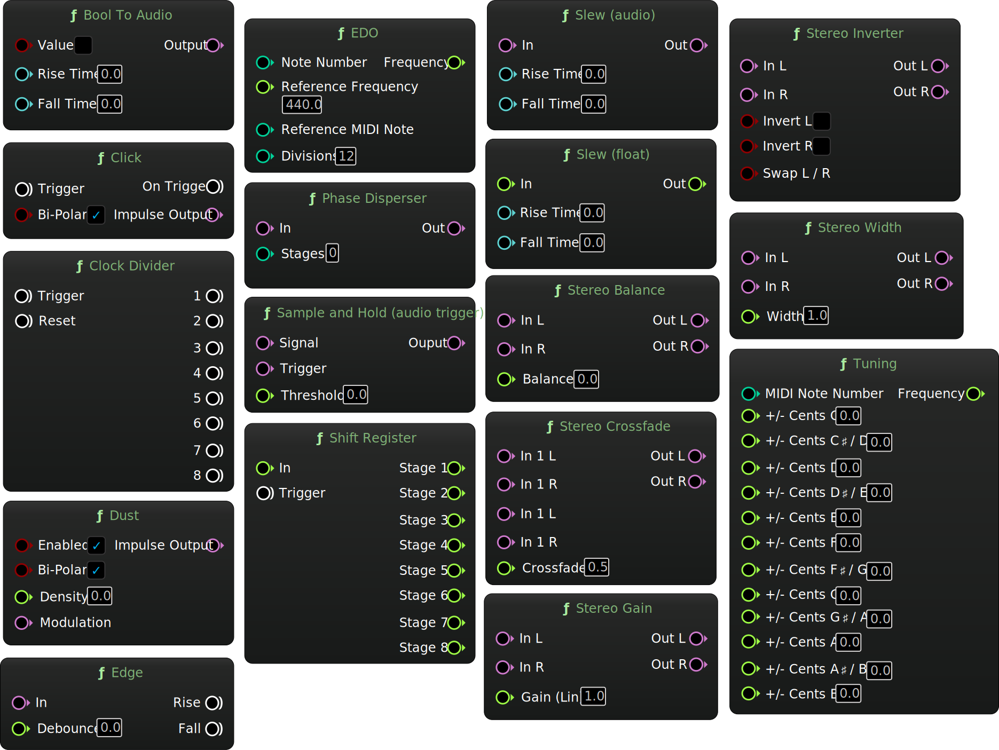

A collection of custom nodes for Unreal Engine's MetaSounds, soon to be released as the *Branches* plugin.

# Nodes

- [Bool To Audio](BoolToAudio.html)
- [Clock Divider](ClockDivider.html)
- [Click](Click.html)
- [Dust](Dust.html)
- [Edge](Edge.html)
- [EDO](EDO.html)
- [Phase Disperser](PhaseDisperser.html)
- [Sample and Hold](SampleandHold.html)
- [Shift Register](ShiftRegister.html)
- [Slew (audio)](Slew(audio).html)
- [Slew (float)](Slew(float).html)
- [Stereo Balance](StereoBalance.html)
- [Stereo Crossfade](StereoCrossfade.html)
- [Stereo Gain](StereoGain.html)
- [Stereo Inverter](StereoInverter.html)
- [Stereo Width](StereoWidth.html)
- [Tuning](Tuning.html)

---

[Charles Matthews 2024](https://github.com/matthewscharles/)